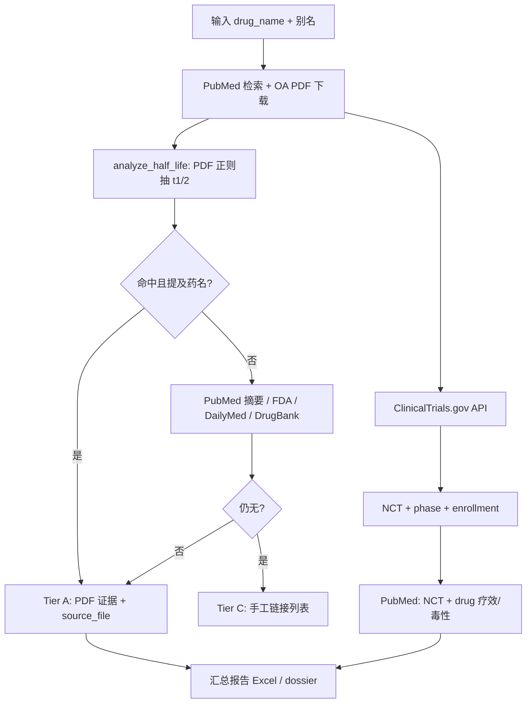

# drug-expert 架构说明

## 是否依赖其他 Cursor Skill？

**不依赖。** `drug-expert` 是独立 Skill，不调用 `create-skill`、`sdk` 等其他 Skill。

运行时依赖的是**本目录内的 Python 代码** +（在 `pubmed` 仓库根目录批处理时）`scripts/` 下的扩展脚本。

## 在 Cursor 里如何引用？

将本仓库（或 `pubmed` 仓库中的 `.cursor/skills/drug-expert/`）放在项目的 `.cursor/skills/drug-expert/`，Agent 会根据 `SKILL.md` 的 `description` 自动匹配「药物文献 / 半衰期 / ClinicalTrials」类任务。

GitHub 镜像：https://github.com/leedony/drug-expert

## 逻辑总览



### 单药（Skill 默认路径）

| 步骤 | 模块 | 输出 |
|------|------|------|
| 1 | `app.api_download` | `downloads/<drug>/` PDF |
| 2 | `analyze_half_life.analyze_drug_folder` | `half_life_*`, `evidence`, `source_file` |
| 3 | `run_drug_expert` 内 `clinicaltrials()` | NCT 表 |
| 4 | `pubmed_search` + `pubmed_fetch` | NCT 关联文献 |
| 5 | `_fda_half_life` / `_dailymed` / `_drugbank` | 标签/库回补 |

### 批量 + 质量校验（pubmed 仓库扩展，推荐汇报用）

| 脚本 | 作用 |
|------|------|
| `scripts/run_drug_expert_full_from_inn_table.py` | 按 INN/主表批量跑 Skill 流程，写 `all_drugs_full_report.xlsx` |
| `scripts/generate_per_drug_dossiers.py` | 每药 7-sheet dossier；**别名校验** PDF 半衰期，标 `FALSE_POSITIVE` |
| `scripts/build_dossier_master_summary.py` | 主表 + dossier 列合并为新 Excel（不覆盖原主表） |

**汇报半衰期请用 dossier 的 `dossier_hl_best_*` 与 `validation_status`，勿单独信任未校验的 PDF `found`。**

## 目录结构

```
drug-expert/                 # 可单独 clone，或置于 .cursor/skills/drug-expert/
  SKILL.md                   # Agent 指令（决策流、命令、输出字段）
  ARCHITECTURE.md            # 本文件
  README.md                  # 人工安装与 MVP 跑通
  app.py                     # PubMed OA 下载 API + Web UI
  analyze_half_life.py       # PDF 半衰期抽取
  run_drug_project.py        # 项目级编排
  pipeline_*.py              # 下载+抽取流水线
  scripts/                   # FC 分型等辅助（可选）
```

`pubmed` 根目录的 `scripts/run_drug_expert_full_from_inn_table.py` 等与上表批处理相关，发布时一并放入本仓库 `scripts/` 便于引用。
